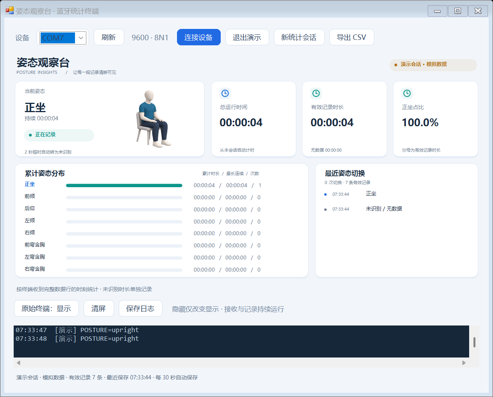

# 姿态观察台

[English version](README.en.md)

姿态观察台是一个 Windows 蓝牙姿态统计终端。它接收姿态识别设备发来的分类结果，把连续的数据转换成容易查看的时长统计，帮助你回顾一次使用过程中保持了哪些姿态、各持续了多久。

界面用 3D 人物示意显示当前姿态，同时展示累计时长、最长连续时长、出现次数、正坐占比和最近的姿态切换。统计结果会自动保存，也可以导出为 CSV，方便在 Excel 中继续分析。

需要在安卓手机上使用时，可以查看本项目的[安卓版本](https://github.com/Misaka2002/Bluetooth-Terminal-for-Posture-Recognition-Android-)。



## 开始使用

程序运行在 Windows 上，需要 .NET Framework 4.x。如果你已有编译好的程序，双击 `PostureStatisticsTerminal.exe` 即可打开；从源码使用时，请先按照下文的方法编译。

先在 Windows 蓝牙设置中配对 HC-06，然后在程序中选择它的传出（Outgoing）COM 口，点击“连接设备”。当前串口参数是 **9600 波特率、8 个数据位、无校验、1 个停止位、无流控**。如果端口被其他串口助手占用，需要先关闭那个程序。

收到有效的姿态数据后，人物示意和统计会自动更新。“原始终端”按钮可以隐藏或恢复接收日志；隐藏只改变显示，蓝牙接收、计时和保存会继续运行。“清屏”也只清除屏幕上的文字，不会清空统计或已经保存的日志。

没有设备时，可以点击“演示模式”体验界面，或双击 `Demo.cmd`。演示使用模拟数据，进入和退出演示时都会创建独立会话，不会混入真实设备的统计。“新统计会话”则会先保存当前记录，再从零开始计时。

## 设备需要发送什么

设备应发送以换行结束的姿态名称，例如：

```text
POSTURE=upright
POSTURE=forward_lean
```

目前支持以下八类姿态，左右方向按人物自身视角判断：

| 设备发送的名称 | 界面显示 |
| --- | --- |
| `upright` | 正坐 |
| `forward_lean` | 前倾 |
| `backward_lean` | 后仰 |
| `left_lean` | 左倾 |
| `right_lean` | 右倾 |
| `forward_hunch` | 前弯含胸 |
| `left_hunch` | 左弯含胸 |
| `right_hunch` | 右弯含胸 |

程序也接受 `LABEL=<名称>` 字段和单独的姿态名称，大小写不敏感。只有数字 `ID` 的消息会显示在日志中，但不会参与统计，因为不同模型的 ID 含义可能不同。

## 时长是怎样计算的

统计从终端创建当前会话时开始。收到第一条有效姿态后，程序开始累计该姿态的时间；接收到另一种姿态时，上一段结束，新的一段开始。同类姿态反复上报会保持为一段连续记录。

主动断开连接会立即结束当前姿态的计时。如果连续 **2 秒**没有新的有效姿态数据，程序会转为“未识别 / 无数据”。连接前、断线后和超时后的时间都单独记录，不会一直算到最后一个姿态上。

各姿态的占比以有效记录总时长为分母。“最长连续时长”表示保持同类姿态最久的一段；“出现次数”表示该姿态有持续时长的记录段数。断线或超时后再次收到同类姿态，会开始新的记录段。

终端依据完整数据行的接收时间计时。因此，它无法补回终端启动前的记录，姿态切换的时间精度也会受到设备发送周期和无线延迟的影响。

## 保存和导出

每个会话都保存在程序旁边的 `sessions/` 目录中。程序每 30 秒保存一次统计，在断开连接、切换模式、新建会话和正常退出时也会保存。再次打开程序会创建新会话，旧记录仍留在本地。

| 文件 | 内容 |
| --- | --- |
| `summary.csv` | 各姿态的累计时长、占比、最长连续时长和出现次数 |
| `timeline.csv` | 每一段姿态的开始时间、结束时间和持续时长 |
| `session.json` | 会话信息、数据来源和汇总指标 |
| `received.log` | 带时间的接收日志 |

点击“导出 CSV”可以把当前统计保存到你选择的目录中，程序会创建一个独立子目录，避免覆盖以前的导出。CSV 使用 UTF-8 编码并带有 BOM，便于 Excel 识别中文；时长以秒保存。接收日志也可以通过“保存日志”单独导出。

如果程序被强制结束，最近一次保存之后的统计可能还没有写入文件。正常退出会保存最后一份记录；保存失败时，界面会给出提示。

## 从源码编译

在项目目录中运行：

```powershell
powershell -ExecutionPolicy Bypass -File .\Build.ps1
```

编译脚本使用 Windows 上的 .NET Framework C# 编译器，不需要下载 NuGet 依赖。生成的 `PostureStatisticsTerminal.exe` 位于项目根目录。3D 图集会嵌入程序，运行时无需联网或另外复制图片。

运行计时核心的测试：

```powershell
powershell -ExecutionPolicy Bypass -File .\Build.ps1 -Test
```

测试覆盖姿态解析、分批接收、姿态切换、断线和超时处理、时长守恒以及 CSV 导出。测试输出写入 `.build/`，不会与真实会话混在一起。

## 项目结构

```text
src/        程序源码和应用清单
tests/      计时核心的测试代码
assets/     编译时使用的 3D 姿态图集
docs/       界面截图和素材说明
Build.ps1   编译与测试入口
Demo.cmd    演示模式入口
```

程序把姿态解析和计时逻辑放在 `src/PostureCore.cs`，界面与串口接收放在 `src/TerminalForm.cs`，圆角控件放在 `src/ModernControls.cs`。3D 素材的来源和图格对应关系见 [素材说明](docs/assets.md)。

本地会话、测试输出和生成的 EXE 已列入 `.gitignore`，不作为源码提交。
